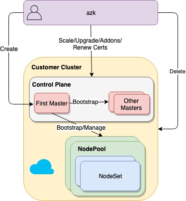

# azkube
Create Kubernetes Clusters on Azure, with configurable controllers, providing provisioning and beyond management capabilities

## Principles

* Kubernetes Cluster should be self managed, infrastructure as well as applications
* External sources can only define target behaviour, the cluster strives to reach the target behaviour
* Extensible to provide new behaviours easily
* No additional resources created to achieve target behaviour
* Provide best possible configured kubernetes cluster for desired workload

## Architecture



* azkube, a gateway client for cluster management
    * Create
    * Scale
    * Upgrade
    * Renew Certs
    * Deploy addons
    * Delete

## Workflow

* azkube checks for existence of target cluster, using resourcegroupname, subscriptionid
* If the cluster does not exist
    * creates prerequisite resources
        * Generate Certificates
        * Generate Infra management manifests
        * Creates networking base infrastructure
    * bootstraps first master (exactly how HA masters are bootstrapped)
* Deploys cluster infra management components
* Yields control to the in cluster infra management component and waits for its completion
* Supporting controllers will create further changes if required
* Any future operations are directly communicated with the target customer cluster

## Usage

```
azkube cluster create flow
```

Provides a questionnaire for installation