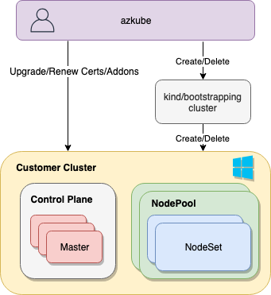

# azkube
Create Kubernetes Clusters on Azure, with swappable pieces

## Architecture

* azkube is gateway client to 
    * Create
    * Upgrade
    * Renew Certs
    * Deploy addons
    * Delete

## Workflow

* azkube checks for existence of target cluster
* If the cluster does not exist, it creates it and stores all the credentials in azure keyvault
* If it already exists, gets the credentials from keyvault and interacts directly with target cluster

